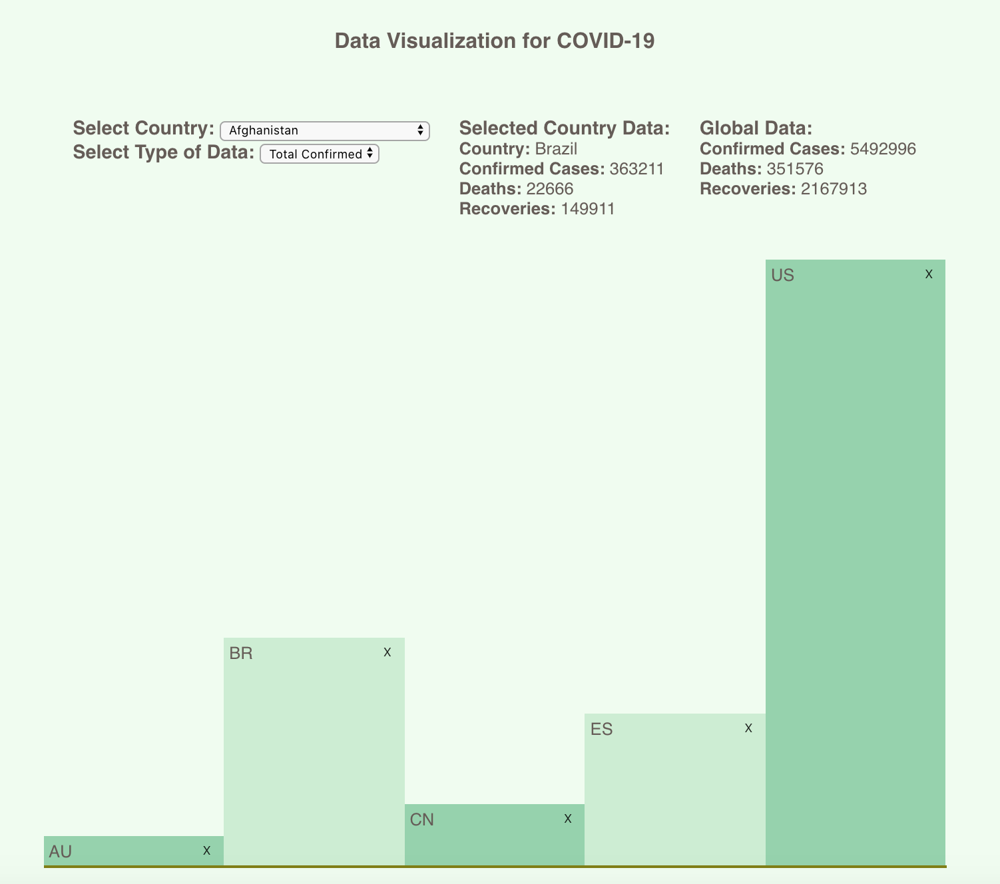

# COVID-19 Data Visualization Project
This is a JavaScript and React project aimed at visualizing COVID-19 data across countries. Data is sourced from [covid19api.com](https://covid19api.com/), which reflects data from the [Johns Hopkins CSSE](https://github.com/CSSEGISandData/COVID-19). 

Users can add and remove countries from the chart visualization, click to get more details, and compare against global data. 

Features in progress include:
* Integration of country population data (for viewing proportion of a given country that has had a confirmed case, died, or recovered)
* Hover/Click widget to replace Selected Country Data block for a better user experience
